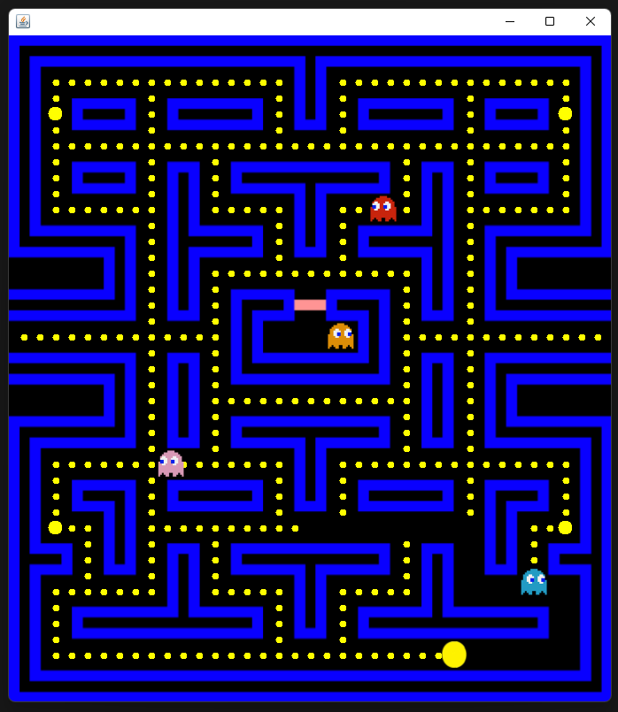
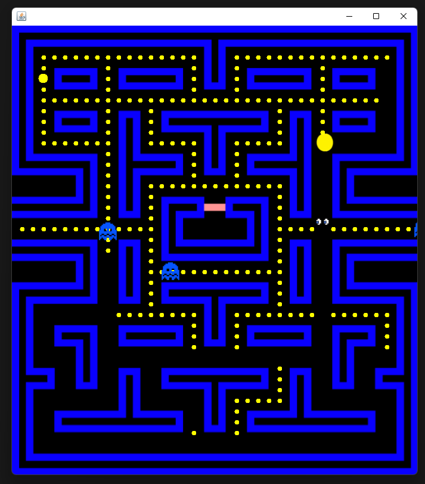

# PacMan

A Java Swing Project to practice my skills. The behaviour of ghosts is similar to the original game, where every ghost has a different point that that follows, that can be ahead or near the pacman. There are some simple animation as the classical mouth movement of tha pacman.

## Screenshots

