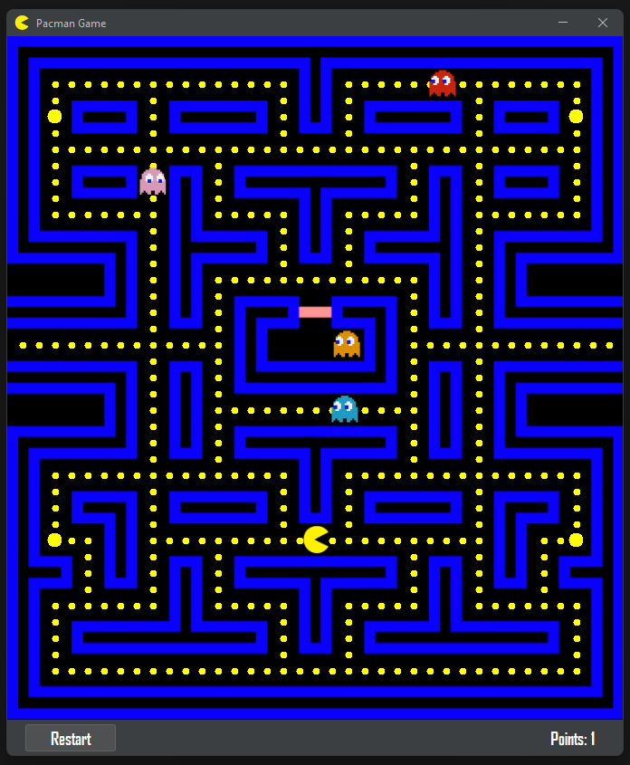

# PacMan

Welcome to my Java Swing-based Pac-Man game! Designed as a project to enhance my programming skills, this rendition of the classic arcade game promises an engaging and nostalgic experience.
Just like the original game, each ghost has its own unique behavior, adding to the challenge and excitement. 

To capture the essence of the classic, I've incorporated iconic animations, including the signature mouth movement of Pac-Man as he navigates the maze. 
The Java Swing interface ensures smooth controls, providing a seamless and enjoyable gameplay experience.

So, dive into the world of Pac-Man once again and experience the thrill of the chase in this Java Swing version. Enjoy the simple pleasures of game development and indulge in a nostalgic journey through the arcade classic! Happy gaming!

## Screenshots

